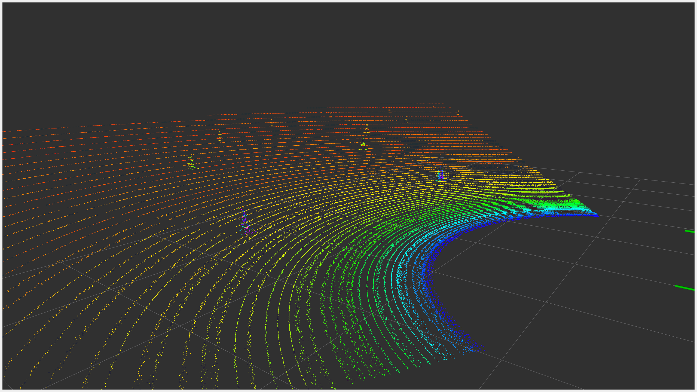

# BetterLiDAR.Gazebo

## 背景

Gazebo原生雷达只返回点云空间位置，不返回随距离和入射角衰减的强度信息。
故自定义雷达插件，使得点云强度更加接近真实情况。

## 环境

- Gazebo Harmonic
- Ubuntu 22.04 Jammy
- ROS2 Humble

## 运行

```bash
# 编译
colcon build --packages-select better_lidar --cmake-args -DCMAKE_BUILD_TYPE=Release
```

```bash
# 运行：基础场景（圆柱、球、方块、锥体）
source install/setup.bash
ros2 launch better_lidar simulation_basic.launch.py
```

```bash
# 运行：锥桶赛道场景
source install/setup.bash
ros2 launch better_lidar simulation_cone.launch.py
```

```bash
# 关闭进程
pkill -f "gz sim" && pkill -f "ros2" && pkill -f "rviz2"
```

